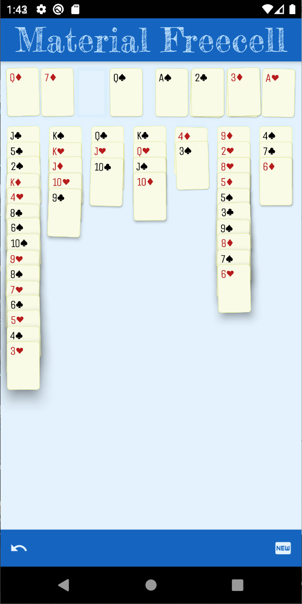
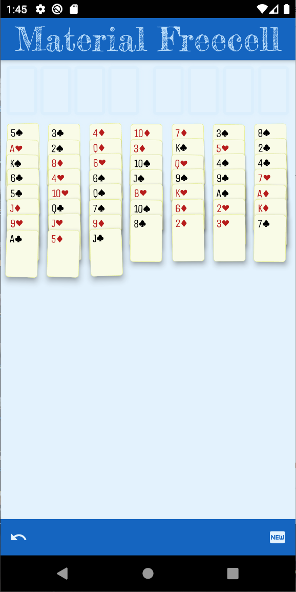

# a110 Material Freecell

 📲 [Get it on the Google Play Store!](https://play.google.com/store/apps/details?id=com.a110.freecell)

 

Please note! This source code is a bit rough as this was my
first project using Dart or Flutter. There are doubtlessly
better patterns for programming this application that I'm
not yet aware of. Additionally there are aspects of the code
that could be expressed more clearly on revision, once time
permits!

